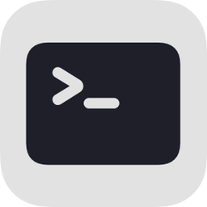

# git+ YAML Documentation 

---

## **Overview**

This config file allows you to execute complex Bash/Zsh commands, dynamically reference inputs and contexts, and create hierarchical command structures. It is highly customizable, supports dynamic reloading, and provides seamless integration with Git and other command-line utilities.

---

For a list of the default, hand crafted commands, see [actions.yaml](actions.yaml)

---

## **Command Structure**

### **Command fields**
| **Field**      | **Type**  | **Description**                                                                 |
|-----------------|-----------|---------------------------------------------------------------------------------|
| `title`        | String    | The name of the command as displayed in Alfred.                                |
| `subtitle`     | String    | (Optional) A short description of the command.                                 |
| `icon`         | String    | (Optional) A path to an image. For built in options, see [Icons](#icons).      |
| `command`      | String    | (Optional) The shell command to execute. Supports [dynamic placeholders](#dynamic-placeholders).                   |
| `subtitle_command` | String  | (Optional) Runs this bash command in python and displays the output as the subtitle. This does not get passed down to subcommands or values (as it can get very slow). Supports [dynamic placeholders](#dynamic-placeholders).                   |
| `values`       | Array     | (Optional) A list of items for the user to select from. When an item is selected, the command will be executed, with `[input]` in the command replaced by the selected value.<br><br>If subcommands are present, the `command` will be ignored and the selected value can be referenced using `[parent]`.|
| `values_command` | String  | (Optional) Treated the same as `values` but the values are generated from this bash command. Each new line is a different value. |
| `should_use_values_as_inline_commands` | Bool | (Optional) Treats each value as its own command, at the current level and not at a sublevel. Only affects this command if there are `values` or `values_command`. |
| `should_trim_values` | Bool | (Optional) This only applies to `values` & `values_command`. If this is `false`, the values will not trim the whitespace. The default is `true` (see `view hunk` command to see how to use this to display text inline in Alfred) |
| `quicklookurl` | String | (Optional) This can be a URL to a file or website and when you press shift, Alfred will show a preview. |
| `mods`         | Array     | (Optional) A list of mod objects, see [Mod fields](#mod-fields).            |
| `subcommands`  | Array     | (Optional) A list of commands ([this table](#command-fields)).                    |
| `should_skip_smart_sort` | Bool | (Optional) Tells Alfred to ignore this command from Alfred's smart search. If every command has this as `true` the commands will keep their order, otherwise they will show up below the items that Alfred prioritizes. This property gets passed down to the `values` & `values_command`. It is useful for showing items always in a specific order (see `status` command for an example of using this in a menu) |

### **Mod fields**
| **Field**      | **Type**  | **Description**                                                                 |
|-----------------|-----------|---------------------------------------------------------------------------------|
| `subtitle`      | String    | The subtitle text to show when the keys are held down.                         |
| `mod`           | String    | The key to press for a mode. Values: `cmd`, `alt`, `ctrl`, `fn`, `shift`, `cmd+alt`. |
| `command`       | String    | The shell command to execute. Supports dynamic placeholders.                   |


### **Dynamic Placeholders**
| **Placeholder**     | **Description**                                                                                     |
|----------------------|-----------------------------------------------------------------------------------------------------|
| `[input]`           | User-provided input at runtime. These characters are escaped automatically: backtick, single quote, double quote, and `$`             |
| `[input_snake_case]`| Same as `[input]`, but converted to `snake_case`.                                                   |
| `[input_new_lines]`|  Same as `[input]`, but converts `  \  ` (space before and after) to a new line. Very helpful for doing multiline content in Alfred. |
| `[parent]`          | Refers to the immediate parent command.                                                             |
| `[parent~n]`        | References `n` levels back in the parent hierarchy.                                                 |
| `[title]`           | Title of the command.                                                                                |


### **Action Placeholders**
| **Placeholder**     | **Description**                                                                                     |
|----------------------|-----------------------------------------------------------------------------------------------------|
| `[view in alfred]`  | If this is the `command`, the workflow with view the repo in Alfred.                                |
| `[reload]`          | Reloads the workflow at the current context after the command runs. Must be echoed to take effect.                         |
| `[reload~n]`        | Reloads the workflow `n` levels back in the hierarchy after the command runs. Must be echoed to take effect.               |


### **Icons**
| **Preview**                                                                 | **Icon Path**    | **Description**                 |
|-----------------------------------------------------------------------------|------------------------|----------------------------------|
|                       | `info.png`            | Represents information or details. |
|           | `down.small.png`      | Indicates a small downward action. |
|                       | `icon.png`            | The default icon for commands.  |
|                   | `action.png`          | Represents an actionable item.  |
|                   | `rebase.png`          | Used for Git rebase actions.    |
|                         | `tag.png`             | Represents Git tags or labels.  |
|               | `down.big.png`        | Indicates a large downward action. |
|                   | `create.png`          | Represents creation of new items. |
|                       | `pick.png`            | Represents selection or picking. |
|                       | `list.png`            | Represents a list or multiple items. |
|                   | `search.png`          | Represents a search or lookup action. |
|                   | `folder.png`          | Represents a folder or directory. |
|                     | `globe.png`           | Represents internet or global scope. |
|                   | `pencil.png`          | Represents editing or writing.  |
|                       | `open.png`            | Represents opening a file or folder. |
|                     | `trash.png`           | Represents deletion or removal. |
|               | `up.small.png`    | Indicates a small upward action. |
|                   | `up.big.png`          | Indicates a large upward action. |
|                       | `fork.png`            | Represents branching or forking. |
|                       | `copy.png`            | Represents copying or duplication. |
|                       | `back.png`            | Represents going back. |
|                     | `check.png`           | Represents a confirmation. |


---

## **Examples**

### **Simple Commands**

#### **Git Fetch**
```yaml
- title: fetch
  command: |
    git fetch -p
```
- **Description**: Updates all branches and prunes remote-tracking branches no longer on the remote.

---

#### **Create a New Git Branch**
```yaml
- title: create
  command: |
    git checkout -b "[input_snake_case]"
```
- **Description**: Creates a new Git branch named after user input, formatted in `snake_case`.

---

### **Intermediate Commands**

#### **Git Pull**
```yaml
- title: pull
  command: |
    git stash; git pull;
  mods:
    - subtitle: Launch Xcode after
      mod: cmd
      command: |
        killall Xcode; git stash; git pull; xed .

    - subtitle: Launch Sublime after
      mod: alt
      command: |
        git stash; git pull; st .
```
- **Description**:
  - Pulls the latest changes from the repository.
  - Optional `cmd` and `alt` modifiers launch Xcode or Sublime after the pull operation.

---

#### **Switch Git Branch**
```yaml
- title: local branches
  values_command: |
    git branch | grep -v '*'
  should_use_values_as_inline_commands: true
  subcommands:
    - title: checkout
      command: |
        git stash; git checkout "[parent]"; git pull;
      mods:
        - subtitle: Launch Xcode after
          mod: cmd
          command: killall Xcode; git stash; git checkout "[parent]"; git pull; xed .
```
- **Description**:
  - Lists all local branches, in line, and shows subcommands that action on the branch. Here there is one command to check out the branch
  - Optional `cmd` modifier launches Xcode after switching.

---

#### **Push Current Branch**
```yaml
- title: push
  command: |
    branch=$(git branch --show-current);
    git push -u origin $branch
  mods:
    - subtitle: Force push
      mod: cmd
      command: |
        branch=$(git branch --show-current);
        git push -uf origin $branch
```
- **Description**:
  - Pushes the current branch to the remote.
  - Optional `cmd` modifier forces the push.

---

### **Advanced Commands**

#### **Tag Management**
```yaml
- title: tags
  icon: tag.png
  values_command: git tag | sort -r
  subcommands:
    - title: checkout
      icon: fork.png
      command: |
        git checkout "[parent]"

    - title: delete tag
      icon: trash.png
      command: |
        git tag -d "[parent]"
      mods:
        - subtitle: and delete remote tag
          mod: cmd
          command: |
            git tag -d "[parent]"
            git push origin --delete "[parent]"
```
- **Description**: 
  - Creates a command called `tags`
  - Lists out all git tags in reverse order, by default
  - Each tag has a subcommand: `checkout` and `delete tag`

---

#### **Interactive Staging**
```yaml
- title: status
  icon: info.png
  subcommands:
    - title: staged
      subtitle_command: |
        staged=$(git diff --cached --name-only | wc -l | xargs)
        echo "$staged file(s)"
      command: |
        staged=$(git diff --cached --name-only | wc -l | xargs)
        git reset '[input]'
        if [ "$staged" -eq 1 ]; then
            echo "[reload~1]"
        else
            echo "[reload]"
        fi
      values_command: |
        git diff --cached --name-only


    - title: modified
      subtitle_command: |
        modified=$(git diff --name-only | wc -l | xargs)
        echo "$modified file(s)"
      command: |
        modified=$(git diff --name-only | wc -l | xargs)
        git add '[input]'
        if [ "$modified" -eq 1 ]; then
            echo "[reload~1]"
        else
            echo "[reload]"
        fi
      values_command: |
        git diff --name-only # git status --short


    - title: untracked
      subtitle_command: |
        untracked=$(git ls-files --others --exclude-standard | wc -l | xargs)
        echo "$untracked file(s)"
      command: |
        untracked=$(git ls-files --others --exclude-standard | wc -l | xargs)
        git add '[input]'
        if [ "$untracked" -eq 1 ]; then
            echo "[reload~1]"
        else
            echo "[reload]"
        fi
      values_command: |
        git ls-files --others --exclude-standard 
```
- **Description**: 
  - Creates a command called `status` that has three subcommands, each with their own dyanmic subtitle
  - Each subcommand shows a list of files
  - If you action one of these commands, because it echoes "[reload]", it will not close Alfred but refresh the script at this location or `~1` back
  - Automatically adjusts the reload behavior based on remaining files, so we stage/unstage the last file, it will reload one command back.

---
