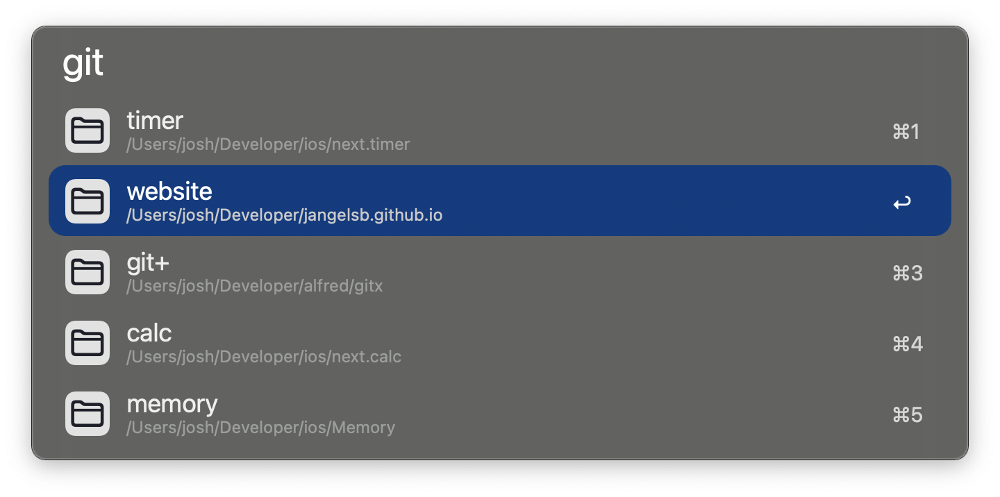
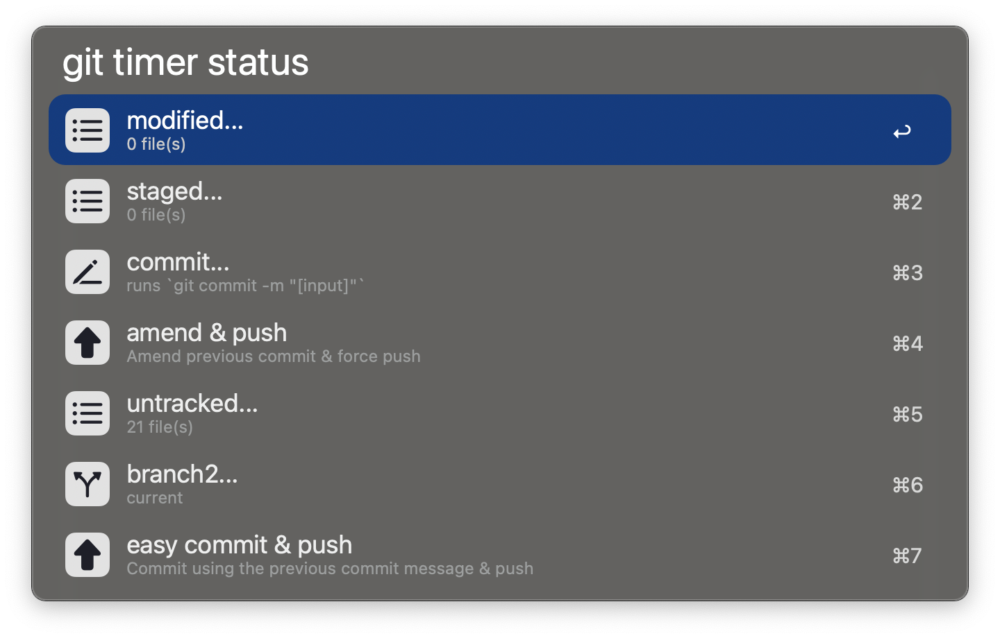
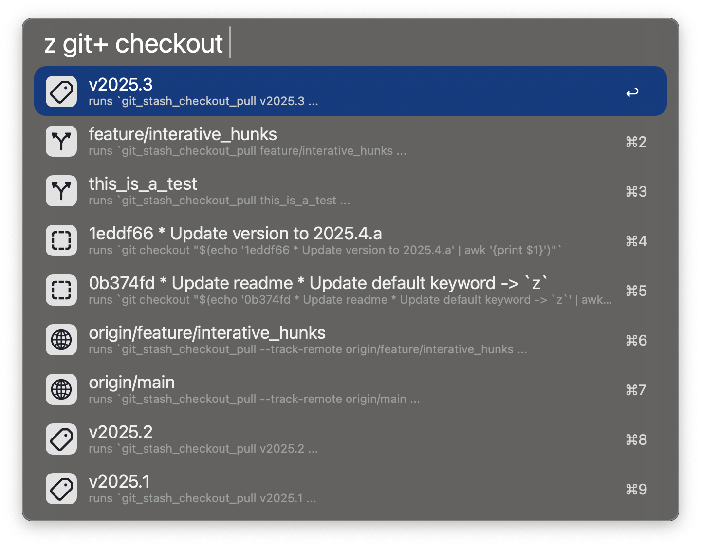
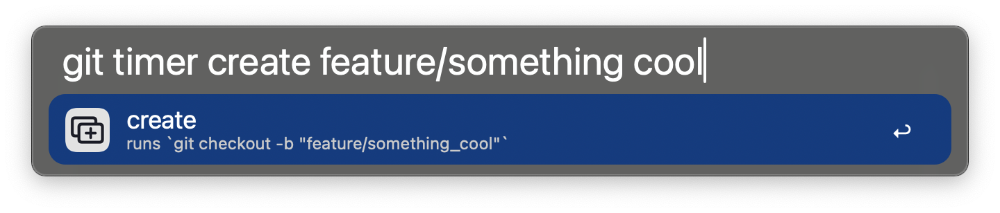
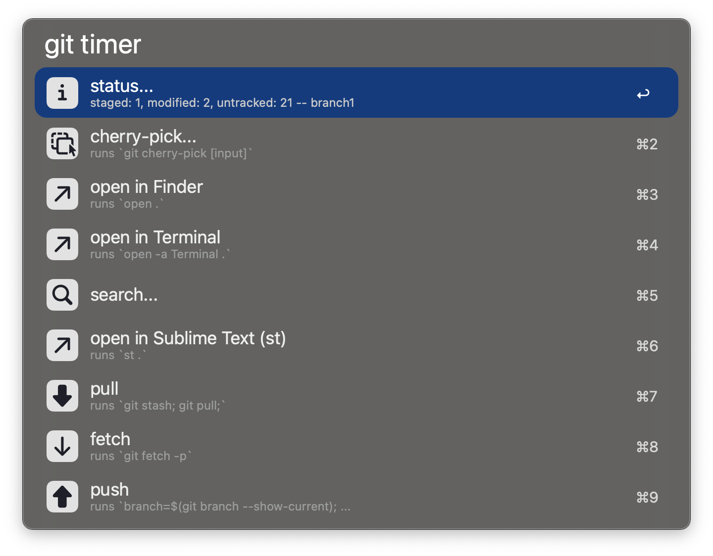

# git+ for Alfred

A highly customizable git interface for Alfred, where you can create your own commands and menus.

For the full documentation, see [docs.md](docs.md)

## Usage

Every command in this workflow is defined here, see [actions.yml](actions.yml)

### Search your repos

### Run commands on your repos

### Check out branches

### Create branches

### Create your own commands

