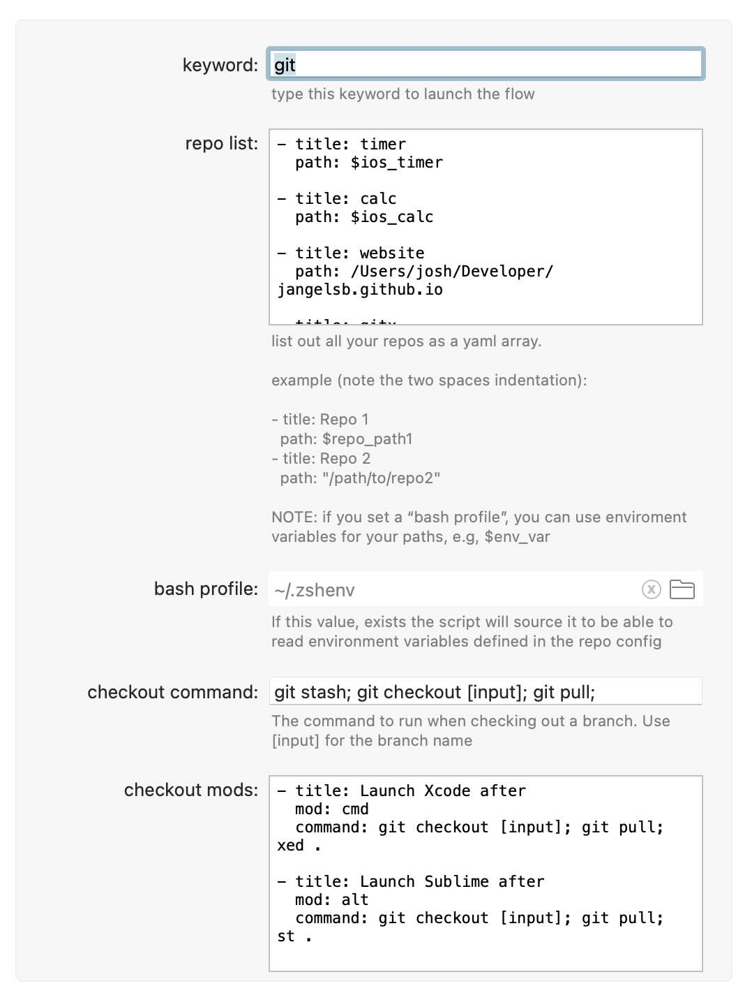
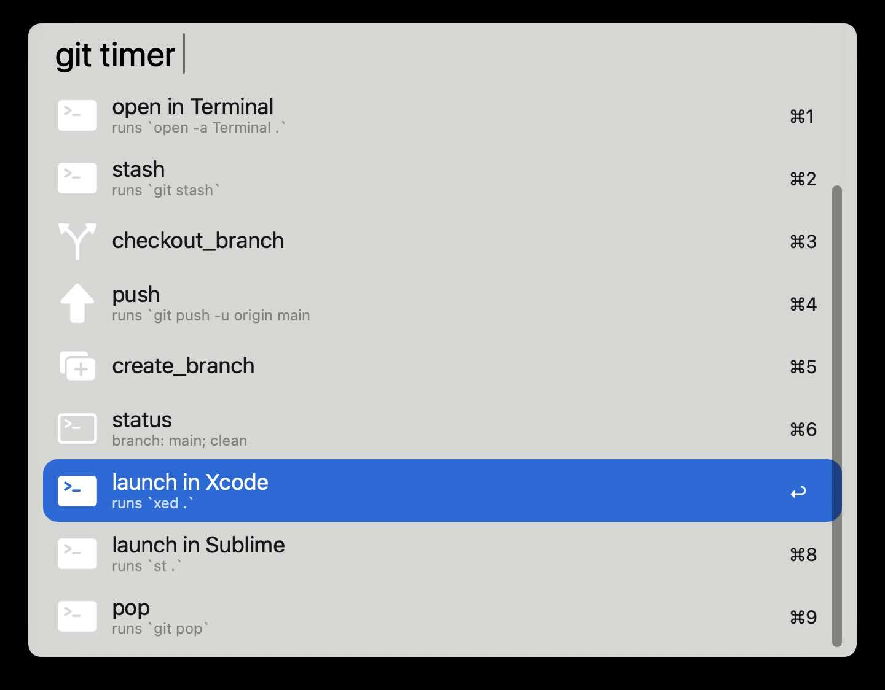

# gitx

A customizable git interface for Alfred

## Usage

### Fully configurable

### Search your repos

### Run commands on your repos

### Check out branches
* you can ⌘c to copy to the branch name!
* you can also make checkout modifiers so that when you hold command ⌘ or alt ⌥ a different command is run 

### Create branches

### Create your own commands
