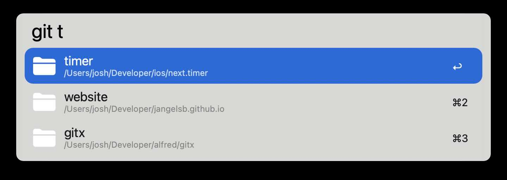
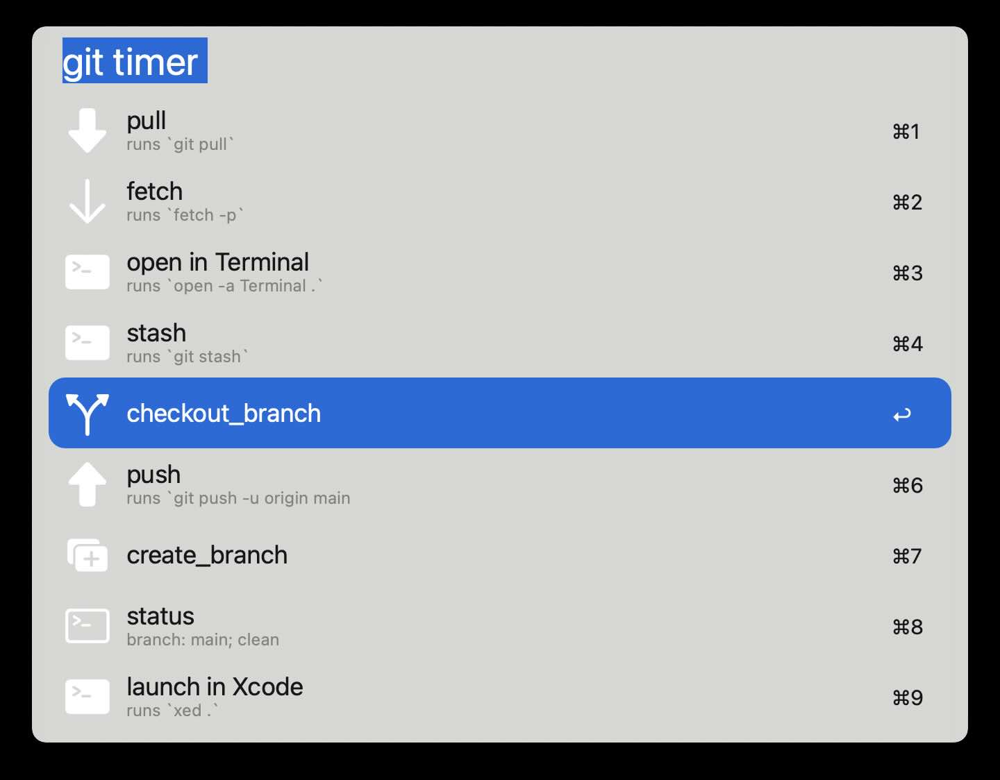
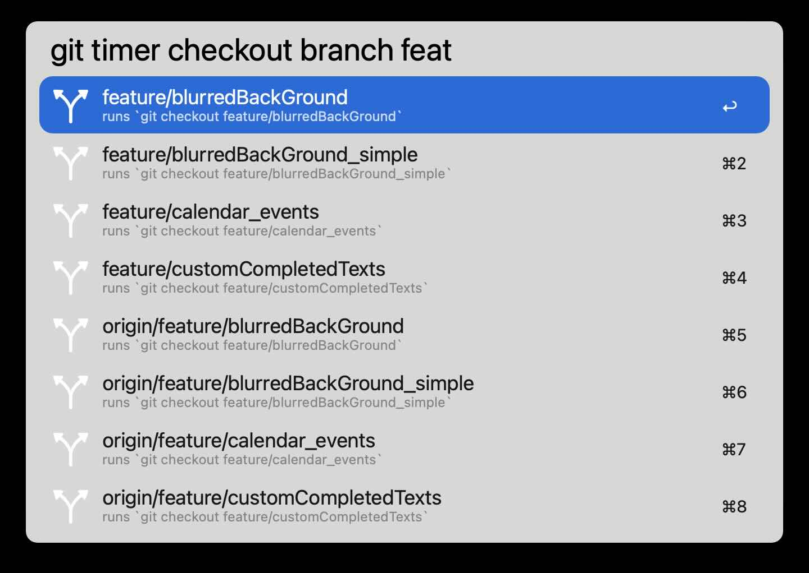

# gitx

A customizable git interface for Alfred

## Usage

### Search your repos

### Run commands on your repos

### Check out branches
* can even do ⌘c to copy to the branch name!

### Create branches
