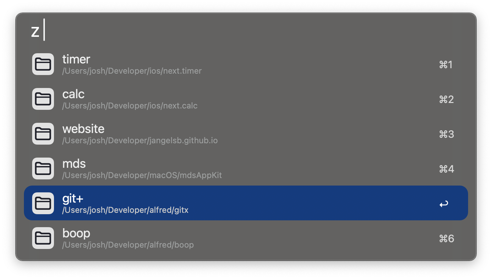
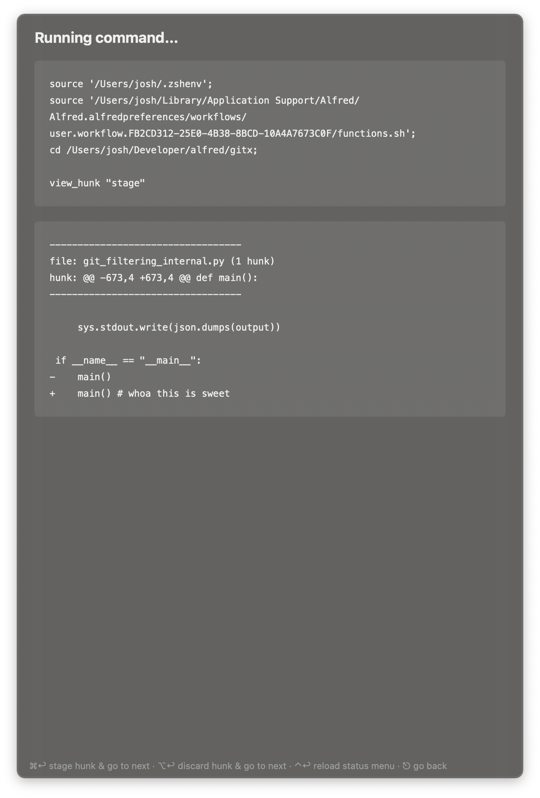

# git+ for Alfred: a fully customizable git & zsh interface

`git+` allows you to create personalized commands and menus to fully streamline ✨your✨ workflow!

See the demo: https://youtu.be/jd8lfsTBDQE

---

For detailed documentation on the commands, see [docs.md](docs.md).

For the official Alfred fourm post, [check here](https://www.alfredforum.com/topic/22463-git-for-alfred-a-fully-customizable-git-zsh-interface/).

---

## 🚀 Features

### Fully customizable


### Supports multiple repos


### A powerful status menu


### Switch branches 


### Create new branches


### Ability to view, stage, and unstage hunks


### And so much more!

* push, push -f
* pull, fetch
* commit
* amend
* stash, pop
* rebase, rebase --onto
* cherry-pick
* history
* stage and unstage files
* copy branch name
* checkout local and remote branch
* checkout tags
* copy diff for tags
* search files in repo
* open repo in Finder, Terminal, Alfred, etc
* `+` anything you want to add 🚀 (see [docs.md](docs.md))


---

## 📖 Installation

### Step 1: Set up your `repo list`
```yaml
- title: Repo 1
  path: $repo_path1

- title: Repo 2
  path: "/path/to/repo2"
  config: /path/to/actions.yaml

- path: /Users/name/Developer/ios
  is_root: true

- title: scripts
  path: /path/to/some/folder
  show_default_commands: false
  config: /path/to/custom/scripts.yaml
```
**NOTE**
* If you set a “bash profile”, you can use enviroment variables for your paths, e.g, `$REPO_PATH`
* Optional flags
  * `config` is an optional path to an actions.yaml that is only for that repo. The working directory for that path is the workflow's directory.
  * `is_root: true` is an optional flag that will add all the subfolders as locations
  * `show_default_commands: false` is an optional flag that will not include any of the default (git) commands for that location


### Step 2 (optional)

- Use the default settings
  
- or **make it your own**
  - All commands in this workflow are defined in a YAML config file: [actions.yaml](https://github.com/jangelsb/git-plus-alfred-workflow/blob/main/actions.yaml)
  - Copy [actions.yaml](https://github.com/jangelsb/git-plus-alfred-workflow/blob/main/actions.yaml) to your computer
  - Update your workflow to use this file
  - Customize it 😎
  
### Step 3 (optional)
- **Add custom commands:** 
  - Change the inline config or add another config file in your setup
  - Create specific configs for certain repositories using `config` from Step 1

- **Add custom zsh commands:** 
  - `functions.sh` is implicilty imported before each command that is run. So you can easily offload common commands for better reusability 
  - You can copy [functions.sh](https://github.com/jangelsb/git-plus-alfred-workflow/blob/main/functions.sh) and tweak it or you can even link to your own file 


---

## 📂 Config Example

Here’s a quick example of what a YAML config might look like:  

```yaml
- title: fetch
  icon: down.small.png
  command: |
    git fetch -p


- title: create
  icon: create.png
  command: |
    git checkout -b "[input_snake_case]"
```

For more information, see the full documentation: [docs.md](https://github.com/jangelsb/git-plus-alfred-workflow/blob/main/docs.md).

---

## 🛠️ Installation

1. Download [the latest workflow](https://github.com/jangelsb/git-plus-alfred-workflow/releases) and import it into Alfred. 
2. Configure the paths in the workflow settings
3. Enjoy & God bless 

