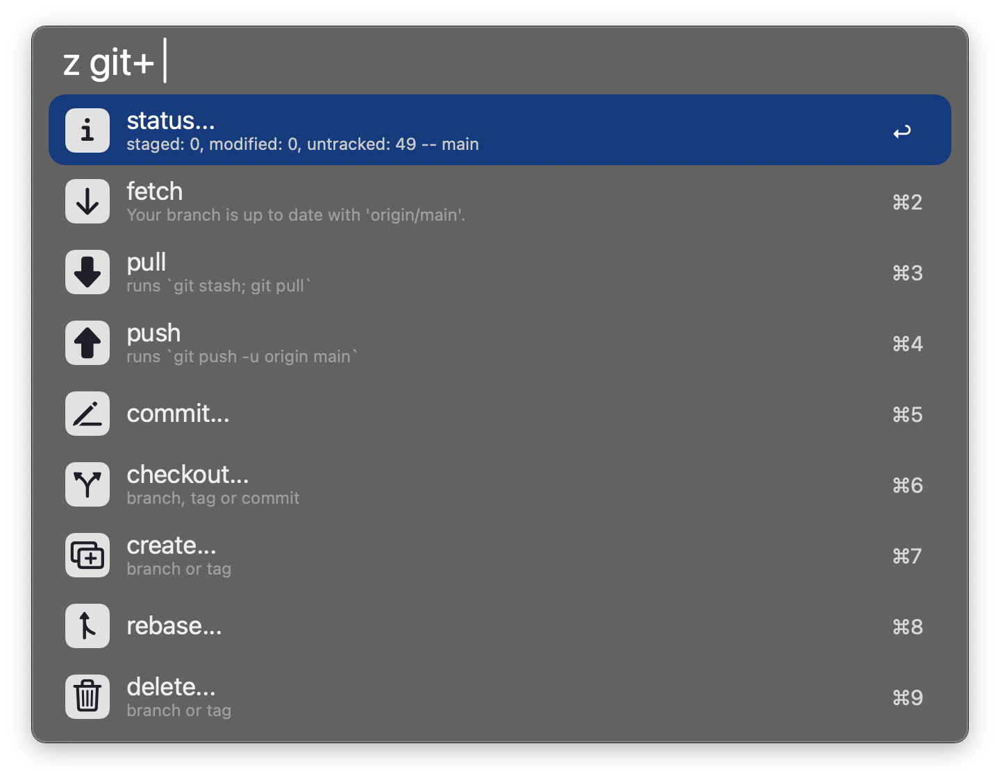

# git+ for Alfred

**A highly customizable Git interface for Alfred, allowing you to create personalized commands and menus to streamline your workflow.**

For detailed documentation, see [docs.md](docs.md).

---

## 🚀 Features

**Search your repos** 
  

**Run commands in your repos**
  

**Switch branches** 
  

**Create new branches**
  

**Customize until your heart's content** 
  

---

## 📖 Usage

All commands in this workflow are defined in a YAML configuration file. See [actions.yaml](actions.yaml) for an example.

### Step 1: Set up your repository configuration

**TBD** (You can add this section later with details on how to configure repos.yaml.)

### Step 2: Customize and Enjoy

1. **Use the default configuration:** The included [actions.yaml](actions.yaml) contains a set of pre-defined commands.  

2. **Create a personalized config file:**
   - Copy the [actions.yaml](actions.yaml) file to a directory on your computer.
   - Reference your copy in the workflow configuration to prevent it from being overwritten during updates.
   - Periodically check [actions.yaml](actions.yaml) for new features or updates.

3. **Add your own commands:**
   - Modify the inline YAML file or include additional YAML files in your configuration.
   - Define repository-specific YAML files for commands unique to certain repos.

---

## 📂 Configuration Example

Here’s a quick example of what a YAML configuration might look like:  

```yaml
- title: fetch
  icon: down.small.png
  command: |
    git fetch -p


- title: create
  icon: create.png
  command: |
    git checkout -b "[input_snake_case]"
```

For more information, see [docs.md](docs.md).

---

## 🛠️ Installation

1. Download the workflow and import it into Alfred.  
2. Configure the paths in the workflow settings.  
3. Have fun.

---

## 📃 Documentation

See [docs.md](docs.md) for full documentation, including advanced features and examples.
