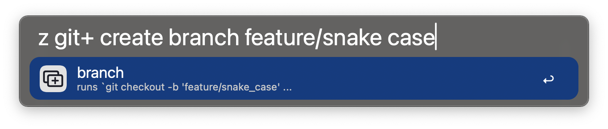

# git+ for Alfred

A highly customizable Git interface for Alfred, allowing you to create personalized commands and menus to streamline your workflow.

For detailed documentation on the commands, see [docs.md](docs.md).

---

## 🚀 Features

### Fully customizable


### Supports multiple repos


### Switch branches 


### Create new branches


### And so much more!


---

## 📖 Installation

### Step 1: Set up your `repo list`
```yaml
- title: Repo 1
  path: $repo_path1

- title: Repo 2
  path: "/path/to/repo2"
  config: /path/to/actions.yaml

```
**NOTE**
* `config` is an optional path to an actions.yaml that is only for that repo. The working directory for that path is the repo's directory.
* If you set a “bash profile”, you can use enviroment variables for your paths, e.g, `$REPO_PATH`


### Step 2 (optional)

- Use the default settings
  
- or **make it your own**
  - All commands in this workflow are defined in a YAML config file: [actions.yaml](https://github.com/jangelsb/git-plus-alfred-workflow/blob/main/actions.yaml)
  - Copy [actions.yaml](https://github.com/jangelsb/git-plus-alfred-workflow/blob/main/actions.yaml) to your computer
  - Update your workflow to use this file
  - Customize it 😎
  
### Step 3 (optional)
- **Add custom commands:** 
  - Change the inline config or add another config file in your setup
  - Create specific configs for certain repositories using `config` from Step 1


---

## 📂 Config Example

Here’s a quick example of what a YAML config might look like:  

```yaml
- title: fetch
  icon: down.small.png
  command: |
    git fetch -p


- title: create
  icon: create.png
  command: |
    git checkout -b "[input_snake_case]"
```

For more information, see the full documentation: [docs.md](https://github.com/jangelsb/git-plus-alfred-workflow/blob/main/docs.md).

---

## 🛠️ Installation

1. Download [the latest workflow](https://github.com/jangelsb/git-plus-alfred-workflow/releases) and import it into Alfred. 
2. Configure the paths in the workflow settings
3. Enjoy & God bless 

